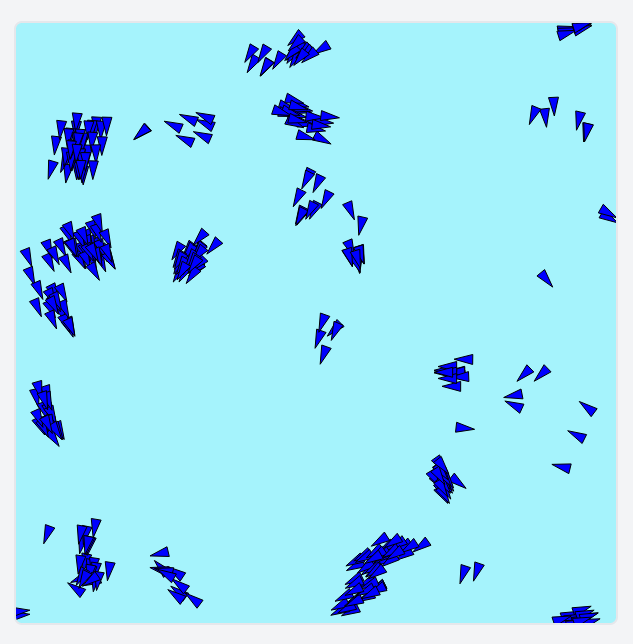

# Boids - Flocking Behaviour Simulation

This project aims to accomplish a simple simulation of boids as described by Craig Reynolds (model of coordinated animal motion, i.e., bird flocks, fish schools).

The goal is to practice and advance in the use of the Go programming language and the WebAssembly standard, APIs, and frameworks provided for it in the language.

Eventually, there should be a couple of images here for a quick look at the result.

## References

- [Original article by Craig Reynolds](https://www.red3d.com/cwr/boids/)
- [Coding Train Video on Boids](https://www.youtube.com/watch?v=mhjuuHl6qHM&t=127s)
- [Sebastian Lague Video on Boids](https://www.youtube.com/watch?v=bqtqltqcQhw)
- [Quad Tree Data Structure - GeeksForGeeks](https://www.geeksforgeeks.org/quad-tree/)  
  *(Note: There is no Go implementation, so I took C++ as a reference.)*
